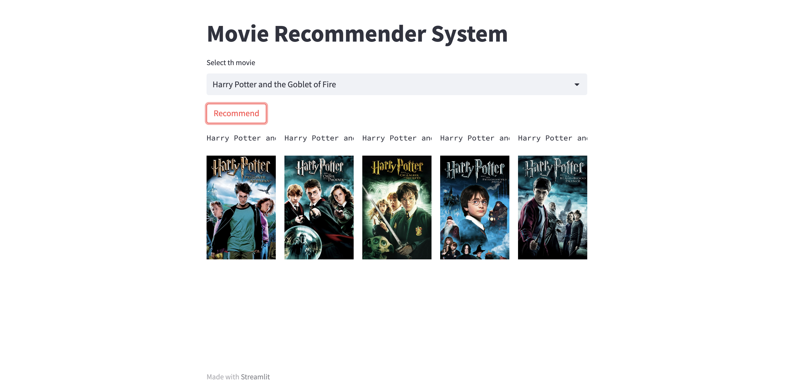

# AI/ML Enthusiast 

## Work Experience
**Artificial Intelligence Developer @ Neuratwin Inc. (Jan 2024 - Apr 2024)**
- ⁠Worked on the Personalized GPT project which allows users to connect personal documents, notes and videos to LLM and query contextually aware answers, boosting efficiency by around 20%.
- ⁠Currently working on Flowlly- AI agent to streamline workflows in construction projects by orchestrating various admin tasks through Flowlly’s LLM-based framework.

**Data Analyst @ Tata Consultancy Services (Oct 2021 - Sep 2022)**
- ⁠Acquired proficiency in MS Excel, SAS, SQL, and Python through structured learning programs and successfully attained certifications within TCS’s platform.
- ⁠Demonstrated expertise in Data Analysis and proficiency in utilizing SAS to identify trends, patterns, and insights that led to significant improvements in the business processes leading to substantial improvements in decision-making and operational efficiency.
- ⁠Designed and implemented SQL queries to execute CRUD operations within the database ensuring efficient data manipulation, retrieval, and management.

## Projects
### Telco Customer Churn
- ⁠Employed Machine Learning Models, such as Logistic Regression and Decision Tree Classifier, resulting in around 79% accuracy for Logistic Regression and about 70% for the Decision Tree Classifier. Conducted Hyperparameter Tuning using Grid Search CV to optimize the performance of the Decision Tree Classifier, enhancing training accuracy to about 79% and testing accuracy to approximately 77%.
- Applied Artificial Neural Network (ANN) algorithm with the early stopping technique to train the model for 100 epochs, resulting in accuracies of approximately 81% in training, and around 78% in testing and evaluation.
- ⁠Utilized Power BI and conducted DAX queries to create an interactive dashboard with a variety of charts, enhancing data visualization for improved comprehension by business professionals.

### Movie Recommender System
- Preprocessed the MovieLens 100k dataset and conducted Exploratory Data Analysis (EDA) to gain insights into the dataset, employing \textbf{Matplotlib and Seaborn} for data visualization to enhance the interpretability of the findings.
- ⁠Employed Natural Language Processing (NLP) techniques, utilized Bag-of-Words and TF-IDF models to convert textual data into vectors, subsequently employing cosine similarity to extract the top 5 movies that exhibit the highest correlation based on their textual content.
- Designed a UI utilizing Python's Streamlit framework for UI to showcase the posters and names of the top 5 recommended movies, providing an interactive and visually engaging user experience.

### Technical Skills
- Machine Learning: Statistics, Web Scraping, Data Cleaning, Data Preprocessing, Feature Engineering, scikit-learn, Linear Regression, Logistic Regression, Random Forest, XGBoost, AdaBoost, Data Visualization, PowerBI, Tableau, NLP, Bag-of-words, TF-IDF, Word2Vec, ANN, CNN, RNN, LSTM.
- Programming Languages: Python, SAS, C/C++.
- ⁠Frameworks: TensorFlow, PyTorch, LangChain, Flask, Streamlit.
- ⁠Cloud Computing: Azure, AWS.
